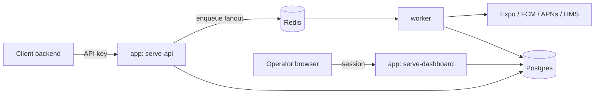

# slay-push

[](https://github.com/sponsors/firemanx07)

Self-hosted, multi-tenant push notification dispatch microservice. Sends directly to Expo,
FCM (HTTP v1), APNs (HTTP/2), and Huawei HMS Push Kit — no proxying through a third-party
push backend. Includes a device/subscriber registry, delivery-status tracking, and a small
server-rendered dashboard. Ships as a Docker image; configured entirely through the dashboard
after `docker compose up`.

## Why

Most self-hosted alternatives either only support one push channel or require running a
separate stack per provider. slay-push is one binary, one Postgres/Redis-backed service,
that talks to all four channels directly, with request/response shapes close enough to
OneSignal's REST API that a team migrating off OneSignal can reuse most of their existing
integration code.

## Status

MVP-complete: self-hostable, multi-tenant, all four providers, dashboard-managed credentials
and API keys. See [CHANGELOG.md](CHANGELOG.md) and the phased roadmap below — the hardening
pass (integration tests, load testing, provider setup docs) is the current focus; not yet
recommended for production use until that lands.

## Architecture



Postgres holds `projects`, `subscribers`, `devices`, `notifications`, `notification_recipients`,
`provider_credentials`, `api_keys`, `users`, and `sessions`.

One Go codebase/image, five run modes selected by the container's `command:`:
`serve-all` (public API + dashboard on one listener — the default), `serve-api`/
`serve-dashboard` (the same two split across separate deployments, for stricter network
isolation), `worker` (asynq queue consumer: resolves targeting, calls provider adapters),
`migrate` (one-shot schema migration).

## Quickstart

```bash
cp .env.example .env
# edit .env: set POSTGRES_PASSWORD, generate APP_MASTER_KEY with `openssl rand -base64 32`

docker compose -f deploy/docker/docker-compose.yml up
```

Then open `http://localhost:8080` — the first visit routes to the setup wizard.

For local development with hot reload and a Seq log viewer:

```bash
docker compose -f deploy/docker/docker-compose.yml -f deploy/docker/docker-compose.dev.yml up
```

Seq UI: `http://localhost:8081`. Seq is dev-only by design — production logging is plain JSON
to stdout, so it plugs into whatever log stack you already run (Loki, ELK, Datadog, CloudWatch).

## Configuration

Only what's needed before the database is reachable lives in env vars (see `.env.example`).
Provider credentials and API keys are configured from the dashboard after first-run setup and
stored in Postgres. (Auth mode is local-only for now — no OIDC yet — and rate limits are a
single global setting; both are on the roadmap below, not dashboard-configurable today.)

| Variable | Default | Notes |
|---|---|---|
| `POSTGRES_PASSWORD` | `pushdispatch` (dev) | set a real password before exposing this beyond localhost |
| `APP_PORT` | `8080` | host-side port for the dashboard/API |
| `APP_MASTER_KEY` | *(none)* | AES-256-GCM key encrypting provider credentials at rest; **losing it makes stored credentials unrecoverable** — there's no external KMS in this design |
| `APP_COOKIE_SECURE` | `true` | marks the dashboard session cookie HTTPS-only; set to `false` only for local plain-HTTP dev |
| `LOG_FORMAT` | `json` | `seq` only meaningful with the dev compose overlay |
| `LOG_LEVEL` | `info` | |

## Roadmap

Phased MVP plan (each phase independently runnable/testable via `docker compose up`):

- [x] 0. Repo & project scaffolding
- [x] 1. Core data model + single-provider (FCM) dispatch
- [x] 2. Multi-provider (Expo/APNs/HMS) + subscriber/device registry + group push
- [x] 3. Multi-tenancy + API keys
- [x] 4. Dashboard + local auth (MVP-complete point)
- [ ] 5. Hardening pass (integration tests, load test, per-provider outbound rate limiting, docs) *(current)*

Post-MVP: OIDC login, bulk device import (OneSignal migration), multi-role dashboard RBAC,
encryption key rotation tooling, and — only once the self-hosted product has real usage — an
optional hosted/cloud offering.

## License

[Apache License 2.0](LICENSE) — permissive open source. Hosting, forking, and commercial use
are all permitted, subject to the license's terms (e.g. preserving copyright/license notices).

## Contributing

Issues and PRs welcome. If this project is useful to you, a
[GitHub Sponsors](https://github.com/sponsors/firemanx07) contribution helps keep it maintained.
