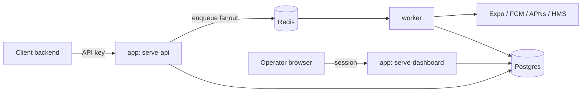

## Overview

One Go codebase and image, running in one of five modes selected by the container's `command:`:

| Mode | What it serves |
|---|---|
| `serve-all` | Public API + dashboard on one listener (the default) |
| `serve-api` | Just the public API — for stricter network isolation |
| `serve-dashboard` | Just the operator dashboard |
| `worker` | The asynq queue consumer: resolves targeting, calls provider adapters |
| `migrate` | One-shot schema migration |

Postgres holds `projects`, `subscribers`, `devices`, `notifications`, `notification_recipients`,
`provider_credentials`, `api_keys`, `users`, and `sessions`.

## Two kinds of auth, deliberately separate

The public API (`/api/*`) authenticates with a bearer API key (`sp_live_...`), scoped to a
project and to `read` or `send`. The dashboard (`/*`) authenticates with a session cookie issued
at login — a single opaque, high-entropy token, hashed and looked up per request, not a JWT. They
never share a code path: an API key can't log into the dashboard, and a session cookie can't call
the API.

## Subscribers vs. devices

A **subscriber** is the grouping/identity concept — one `external_id` you assign, matching
OneSignal's `external_user_id`. A **device** is one channel-specific delivery endpoint (one push
token on one platform) belonging to a subscriber. Registering a second device under the same
`external_id` doesn't replace the first — it adds a sibling, and a group push to that subscriber
fans out to every active device beneath it.

This split also isolates identity state (a subscriber can be `opted_out`) from delivery-endpoint
health (a device is `active`, `stale`, or `invalid`) instead of conflating the two.

## Everything after intake is async

`POST /api/v1/notifications` never resolves an audience or calls a provider in the request path —
it inserts a `pending` row and enqueues one job. A separate `worker` process resolves targeting
and dispatches to providers, with per-provider queues so a slow or down provider never blocks the
others, retry/backoff on transient failures, and an idempotency anchor
(`notification_id, device_id`) so a retried enqueue can't double-send.

## Adding a provider or a targeting strategy

Both are Open/Closed extension points, not a growing `if`/`switch`:

- A provider adapter is a small package that self-registers into a factory registry on import.
  Adding a fifth provider means adding one new package — dispatch code never changes.
- A targeting strategy resolves a notification's audience (explicit device IDs, or every device
  under a set of external IDs today). A future strategy — segmentation by tag filters, for
  example — would be a third implementation of the same interface, not a rewrite of the first two.
